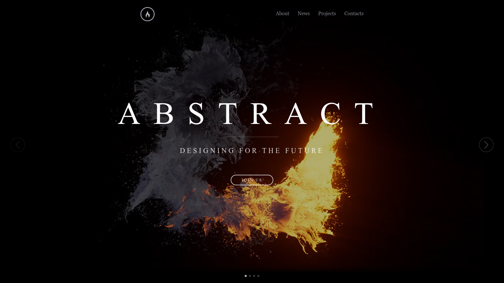
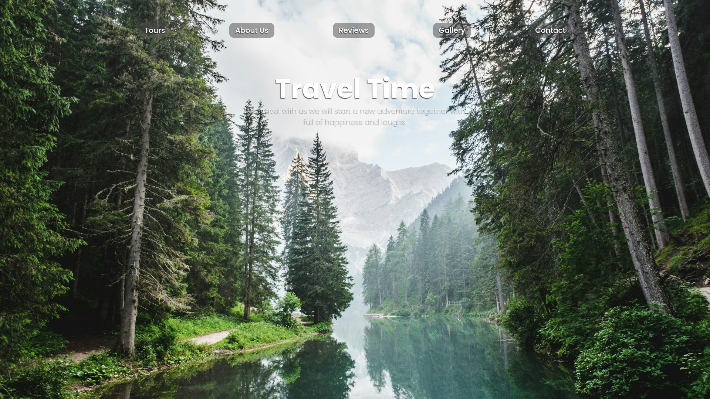
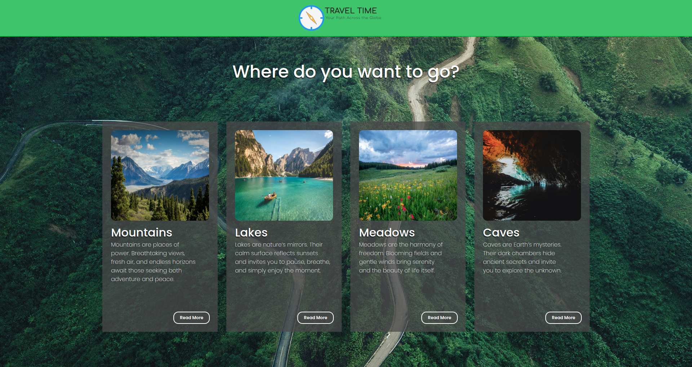
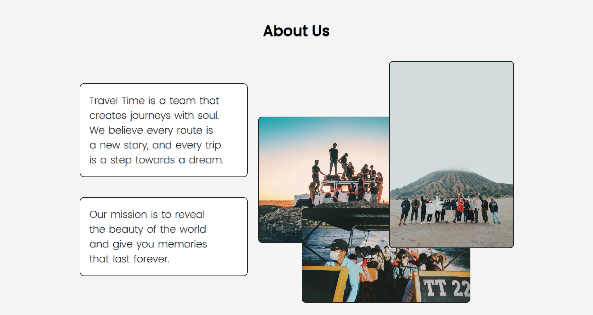
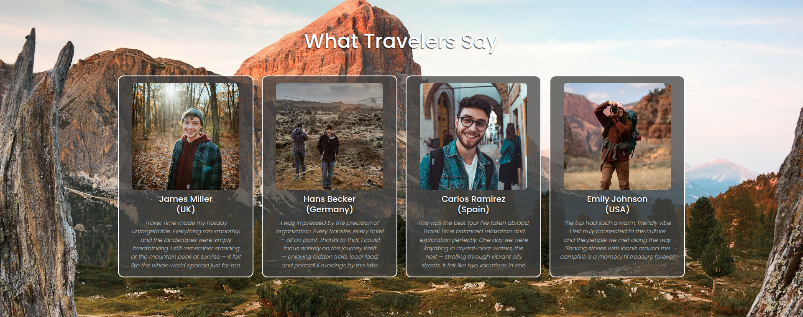
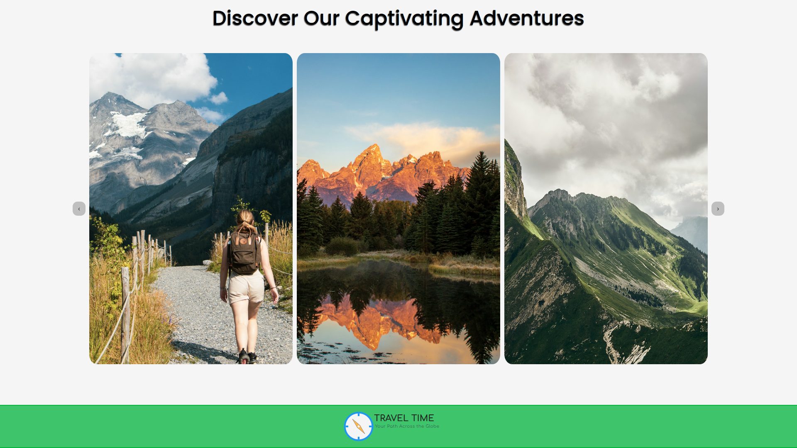
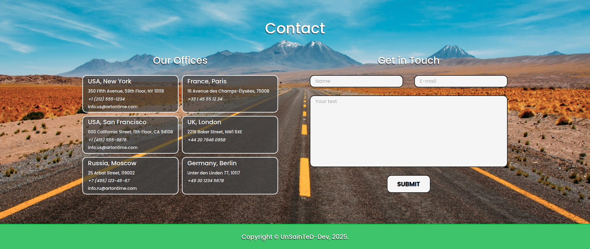

# Web Page Layouts

📌 Репозиторий с моими учебными и практическими наработками по верстке макетов из **Figma** и не только.

---

## 📖 About the Project

Этот репозиторий служит сборником моих экспериментов и практики вёрстки макетов из **Figma** и учебных курсов.
Основная цель — отработка **HTML**, **CSS**, **SCSS**, **JavaScript**, закрепление адаптивной вёрстки и современных подходов к разработке.

*Каждый макет оформлен как отдельный проект с собственной структурой и стилями.*

---

## 📁 Contents

- <details>
   <summary><code>Createx/</code> | 2025-07-19 — сверстанный по учебному курсу с YouTube и Figma.</summary>
   
   
</details>

- <details>
   <summary><code>Air/</code> | 2025-08-24 — сверстанный по макету Figma.</summary>
   
   
   
</details>

- <details>
   <summary><code>Lease-Cars/</code> | 2025-08-29 — сверстанный по учебному курсу с YouTube и Figma.</summary>
   
   
</details>

- <details>
   <summary><code>Lease-Cars-Improved/</code> | 2025-08-30 — "Lease Cars" с правками и улучшениями, адаптивным дизайном.</summary>
   
</details>

- <details>
   <summary><code>Travel-Time/</code> | 2025-08-31 — сверстанный по макету Figma</summary>
   
   
   
</details>

- <details>
   <summary><code>Abstract/</code> | 2025-09-01 — сверстанный по учебному курсу с YouTube</summary>
   
</details>

- <details>
   <summary><code>Travel-Time-Improved/</code> | 2025-09-10 — "Travel Time" со значительными изменениями, улучшениями и респонсивным дизайном.</summary>
   
   
   
   
   
   
</details><br>

- *(в будущем)* новые проекты и страницы.

---

## ⚙️ Tech Stack

<!-- 🔹 Languages & Core -->


<!-- 🔹 JS Libraries & Frameworks -->


<!-- 🔹 Tools & Build -->


<!-- 🔹 Design -->


<!-- 🔹 Version Control & Deployment -->


---

## ⚡ Getting Started

1. Склонировать репозиторий:
   ```bash
   git clone https://github.com/UnSainTeD-Dev/web-page-layouts.git
   ```
2. Перейти в нужную папку (например, Air/).
3. Открыть "index.html" в браузере.
4. Или открыть корневую папку web-page-layouts в Visual Studio Code и переключаться через внутренний проводник между папками (Air/, Travel-Time/, Createx/...).
