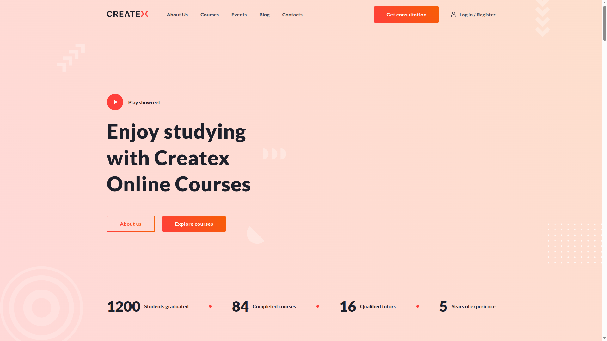
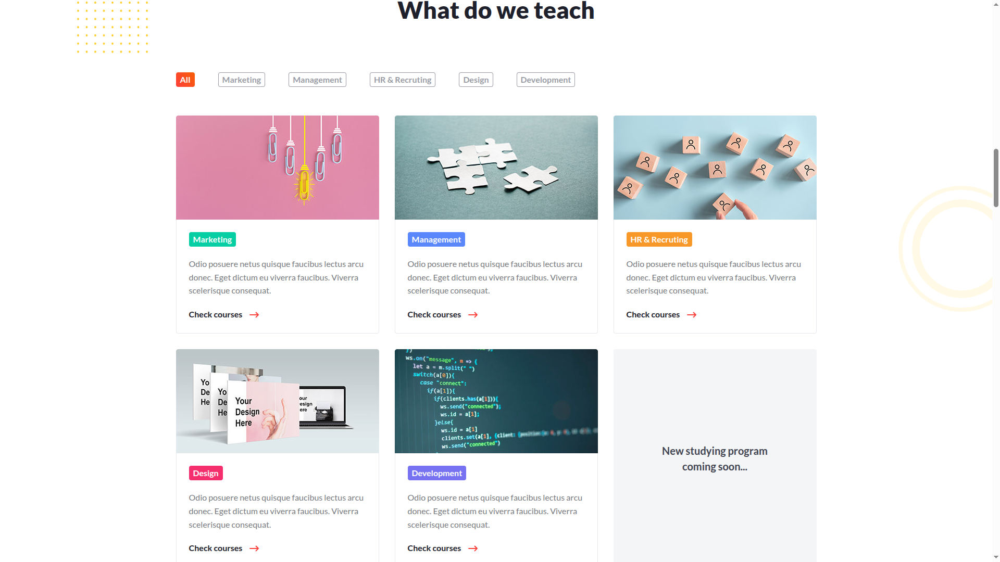
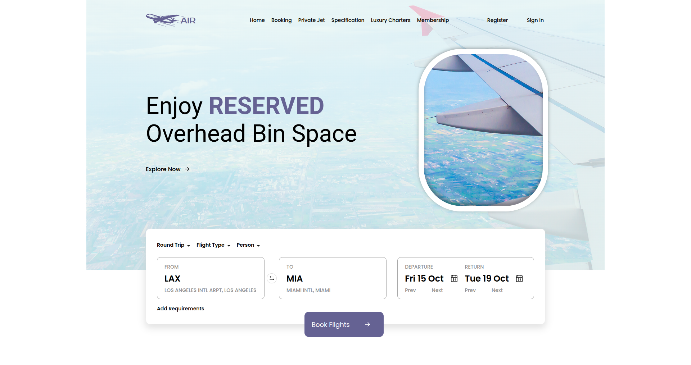
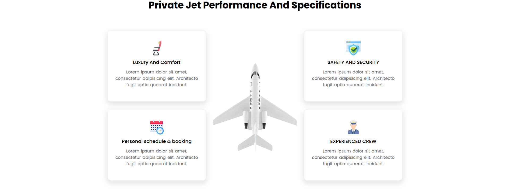
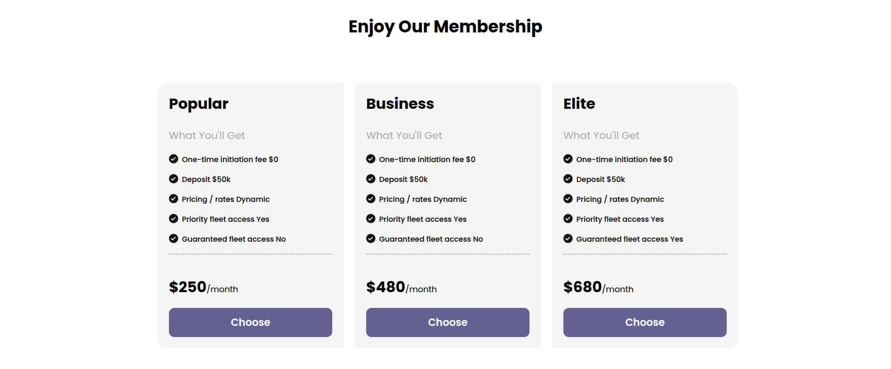
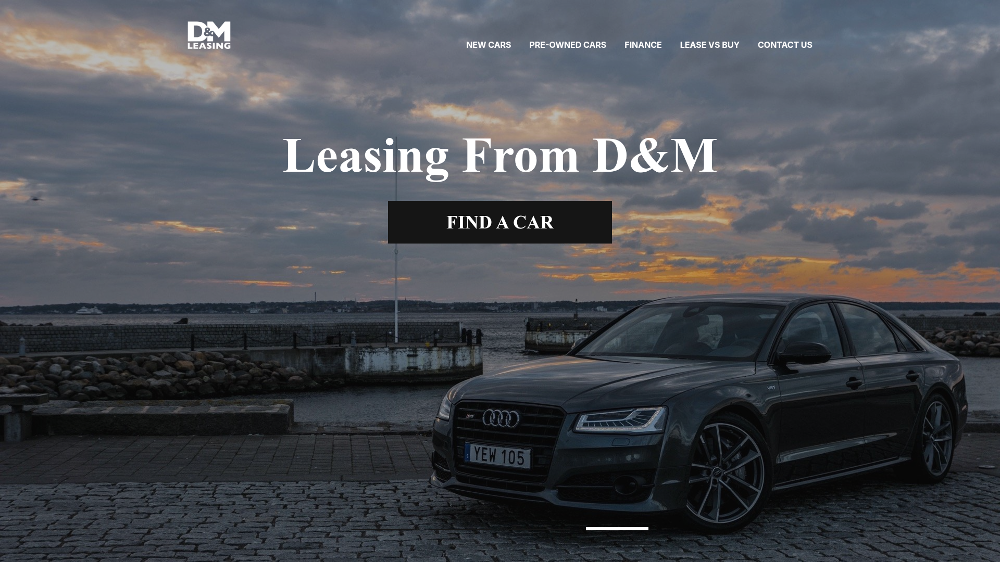
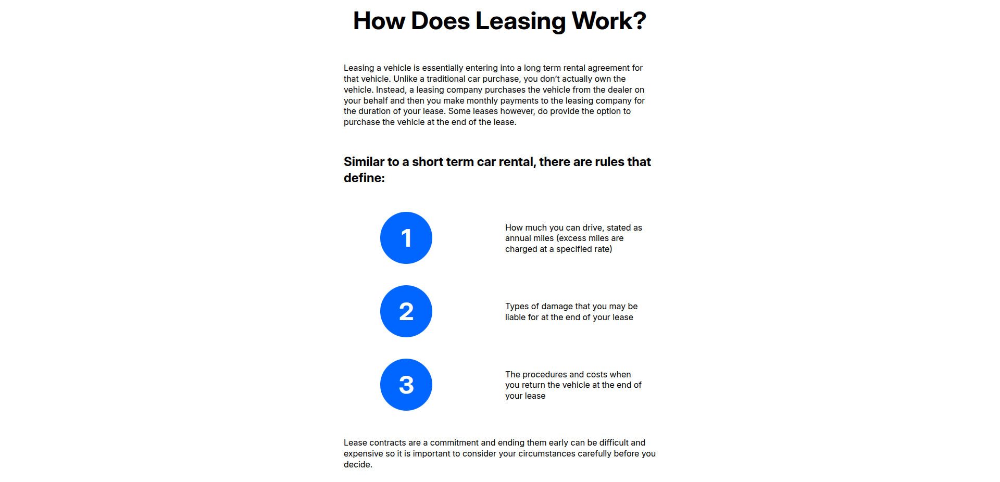
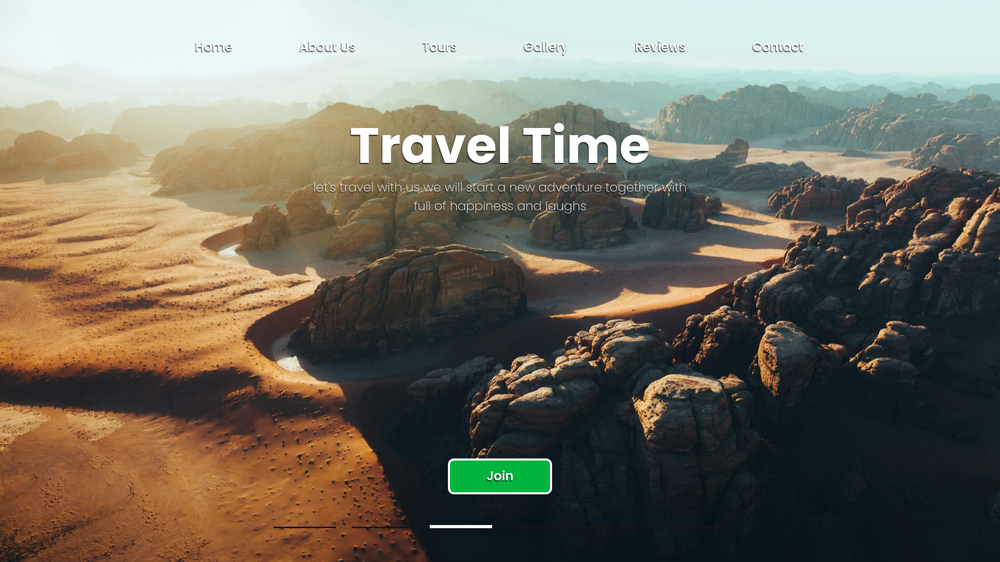
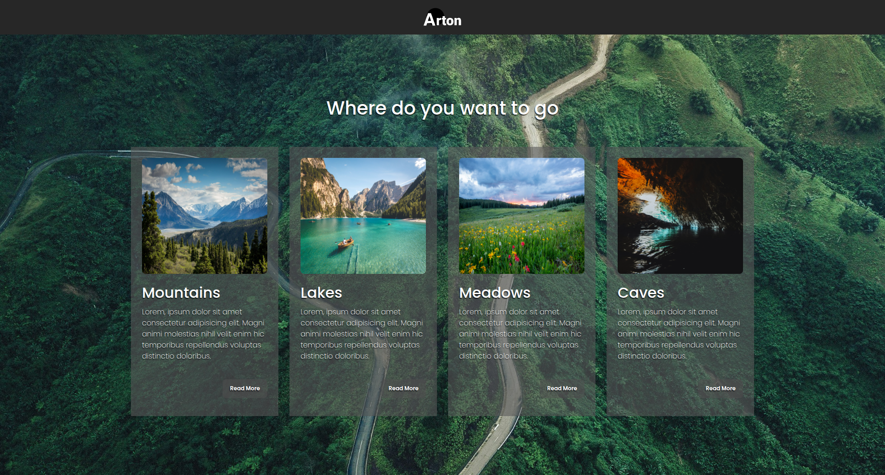
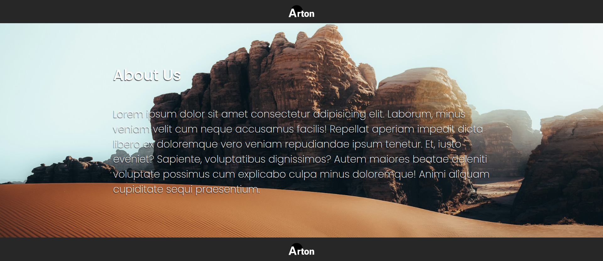

# Web Page Layouts

📌 Репозиторий с моими учебными и практическими наработками по верстке макетов из **Figma**.

---

## 🔍 О проекте

Этот репозиторий служит сборником моих экспериментов и тренировки в верстке.
Основная цель — отработка **HTML, CSS, SCCS, JavaScript.** и улучшение навыков адаптивной вёрстки.

*Каждый макет оформлен как отдельный проект.*

---

## 📂 Содержимое

- <details>
   <summary><code>Createx/</code> | 2025-07-19 — сверстанный по учебному курсу с YouTube и Figma.</summary>
   
   
</details>

- <details>
   <summary><code>Air/</code> | 2025-08-24 — сверстанный по макету Figma.</summary>
   
   
   
</details>

- <details>
   <summary><code>Lease-Cars/</code> | 2025-08-29 — сверстанный по учебному курсу с YouTube и Figma.</summary>
   
   
</details>

- <details>
   <summary><code>Lease-Cars-Improved/</code> | 2025-08-30 — "Lease Cars" с правками и улучшениями, адаптивным дизайном.</summary>
   
</details>

- <details>
   <summary><code>Travel Time/</code> | 2025-08-31 — сверстанный по макету Figma</summary>
   
   
   
</details><br>

- *(в будущем)* новые проекты и страницы.

---

## 🛠️ Стек технологий

- **HTML5**, **CSS3**, **JavaScript**
- **Tools**: *[Visual Studio Code](https://code.visualstudio.com/)*
- **Libraries**: *[Swiper](https://swiperjs.com/)*

---

## 🚀 Как открыть проекты

1. Склонировать репозиторий:
   ```bash
   git clone https://github.com/UnSainTeD-Dev/web-page-layouts.git
   ```
2. Перейти в нужную папку (например, Air).
3. Открыть "index.html" в браузере.
4. Или окрыть папку "web-page-layouts" с помощью Visual Studio Code, к примеру, и переключаться через внутренний проводник.
